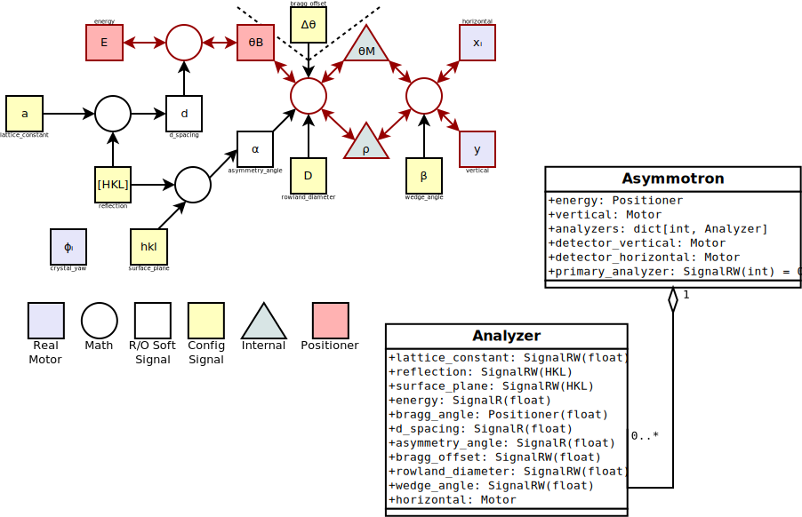

###################
Asymmetric Analyzer
###################

An asymmetric analyzer filters emitted X-rays by wavelength. In
contrast to a traditional analyzer, an asymmetric analyzer can use
reflections besides the specular reflection for re-directing photons.

The device :py:class:`haven.devices.asymmotron.Analyzer` contains all
the math to control an individual analyzer crystal.

The following diagram shows the signal flow. Note that *config
signals* are local: changing them in one environment (e.g. Firefly)
will not affect any other environment (e.g. Queueserver).

   Diagram of asymmetric analyzer signals in the Analyzer device.
   *Config signals* can be modified without moving physical
   motors. *Positioner* signals will move physical motors when
   changed.

The device can be moved by setting the *config signals* to their
desired values, then setting *energy* to move the analyzer:

.. code-block:: python

   from bluesky.plan_stubs import mv
   from bluesky.plans import scan
   from ophyd_async.core import init_devices   
   from haven.devices import Analyzer
   from haven import run_engine

   RE = run_engine()

   # Create, and connect to, the analyzer device
   with init_devices():
       analyzer = Analyzer(
           horizontal_motor_prefix="255idcVME:m1",
           vertical_motor_prefix="255idcVME:m1",
           yaw_motor_prefix="255idcVME:m1",
           name="herfd_analyzer",
       )

   # Set up the configuration signals
   RE(mv(analyzer.reflection, "211"))

   # Perform a scan for data acquisition
   detectors = [...]
   RE(scan(detectors, analyzer.energy, 8000, 8300, num=31))
